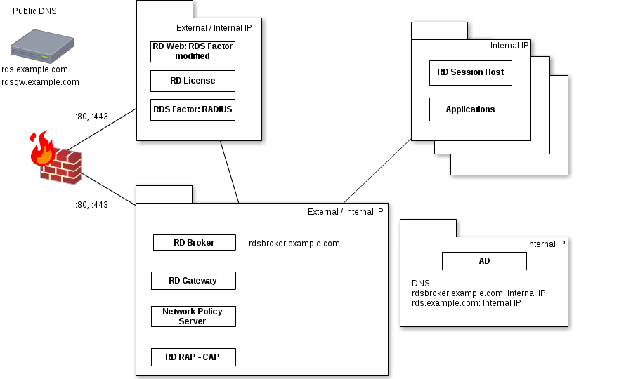

# RDS Factor

Two-factor authentication for Windows 2012 R2 Remote Desktop Services (RDS).

RDS Factor consist of two components:
* A server component that talks RADIUS with RD Web and the RD Gateway.
* An  updated version  of the  RD Web  pages that  interacts with  the
  RADIUS server and an opt-in multi-factor form.

RDS Factor works by sending an SMS to the user after they've
authenticated with their user name and password. The SMS contains a
key which when entered, allow them entrance to RD Web. Clicking on an
application in RD Web opens a window in the gateway for that user. In
that way, users that are not authenticated via RD Web cannot access
the RD Gateway. Compare this to the standard RDS setup, where there is
no way to share state between RD Web and RD Gateway, meaning that the
gateway is always open for logging in with credentials.

You can also disable two-factor authentication in RDS Factor. In this
case, RDS Factor maintains state between RD Web and RD Gateway,
ensuring that users *must* have logged into RD Web before connections
are allowed through the gateway. This allows custom multi-factor
authenticators in front of RD Web to also protect the gateway.

Tested on Windows 2012 R2.

Here is a diagram of an example RDS architecture to ease understanding:


## Prerequisites

An RDS setup. There are many options for orchestrating the RDS setup; the minimal RDS setup for use with RDS Factor consist of two servers: 
* Active Directory; and
* RDS with Gateway component enabled

Use 'Active Directory Users and Computers' to add a mobile number to
relevant LDAP users in the Active Directory. The tool is not installed
per default; you can find it in `Add Roles -> Features -> Remote
Server Administration Tools -> AD DS Tools -> AD DS Snap-Ins And
Command-Line Tools`

## Installation

Grap the latest [rdsfactor.zip](https://github.com/jakobadam/RDSFactor/releases/latest) release from github. And unzip it.

### RD Web update
RDS factor comes with a customized version of the RD Web pages. To install these, in an terminal running with administrative rights, run:

```
C:\RDSFactor> install-web.bat
```

After install go and configure the application in IIS. `RDWeb -> Pages -> Application Settings`. You should configure the following settings:
* `RadiusSecret` Shared secret — of your own chosing — used for encrypting RADIUS traffic
* `RadiusServer` IP of the radius server

### RADIUS server installation

The RADIUS server component can be installed on any server reacheable by both the RD Web and the RD Gateway. To install the server as a service run:

```
C:\RDSFactor> install-server.bat
```

After install go and configure the server. Open the file `RDSFactor/server/bin/release/conf.ini` for editing. You should configure the following settings:
* `LDAPDomain` IP of LDAP server to authenticate user and lookup phonenumber against 
* `ADField` LDAP attribute to use for looking up the user's phonenumber
* `EnableOTP` Boolean (0|1) that indicates whether to use the 2. factor for auth
* `Debug` Enable debug output to  `RDSFactor/server/bin/release/log.txt`
* `{client}={shared secret}` IP of RD Web and shared secret — same as
  `RadiusSecret` — for encryption
* `Provider` URL of SMS provider. RDS Factor inserts the number and a message in the two variable, `***NUMBER***` and `***TEXTMESSAGE***`, in the provider URL. An example URL using the SMS gateway cpsms: https://www.cpsms.dk/sms/?username=myuser&password=mypassword&recipient=***NUMBER***&message=***TEXTMESSAGE***&from=CPSMS

To reload the configuration restart the RADIUS server service by running
```
C:\RDSFactor> restart-server.bat
```

### Configure RD Gateway

The gateway must be configured to talk to the RADIUS RDSFactor server. Open up the 'Remote Desktop Manager' and
`Right Click on RDS -> Properties -> RD CAP Store`. 

Here you must:
* Check 'Request clients to send statement of health' 
* Check 'Central Server running NPS'
* Enter the name or IP of the server running the RDSFactor server and add the shared secret

The Network Policy server on the RD Gateway should now proxy RADIUS requests to RDSFactor. You can check the setup of the NPS server by running the 'Network Policy Server' application on the gateway. 

We have experienced that the 'TS GATEWAY AUTHORIZATION POLICY' blocks requests due to the condition of that policy. The fix is relax the requirements of the NAS port type. We have: Virtual (VPN), Ethernet or Cable.

## Logging

Log output from the RADAR client in RD Web is output into:
```
C:\RDSFactor\web\RDWeb\Pages\log> radius_client.txt
```

Log output from the RADAR server:
```
C:\RDSFactor\server\bin\Release> log.txt
```

The RD Gateway log:
```
Event Viewer: Applications and Services Logs / Microsoft / Windows / TerminalServices-Gateway / Operational
```

The Network Policy Server log:
```
Event Viewer: Custom Views / ServerRoles / Network Policy and Access Services
```
## Hacking on RDS Factor

The core RADIUS server is included in this project as a git submodule. Fetch it by:

```
C:\RDSFactor> git submodule update --init
```

Open the RDSFactorWeb project in Visual Studio. 

You run the debugger by attaching it (Ctrl-Alt-P) to the IIS process, check 'show processes from all users', select `w3wp.exe`.

## Acknowledgements

* Claus Isager — for the first open source two-factor RDS
  authenticator, the basis for this project.
* Nikolay Semov — for the core RADIUS server 

## License

RDS Factor is an open source project, sponsored by
[Origo Systems A/S](https://origo.io), and released under terms of the
GNU General Public License, version 3.
